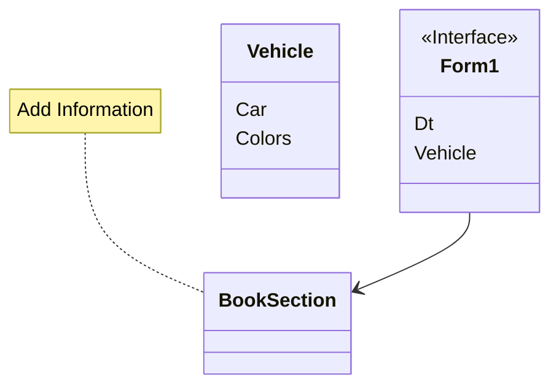

# FinalProject
จองที่จอดรถสำหรับพนักงาน

ความเป็นมาของโปรแกรม

	เนื่องจากที่จอดรถในที่ทำงานเช่น Central, Big C, Lotus นั้นมีผู้คนเขข้าออกเป็นจำนวนมากทำให้ลานจอดรถ
	เต็มบ้างว่างบ้างทำให้พนักงานที่เขาเป็นช่วงบางคนไม่มีที่จอดรถ 

# วัตถุประสงค์ของโปรแกรม

	ต้องการทำให้พนักงานหรือผู้ที่ทำงานในสถานที่เบื้องต้นมีสถานที่จอดรถ ไม่ว่าจะเป็น รถยนต์ หรือ จักรยานยนต์
	สามารถเข้าทำงานได้โดยไม่เสียเวลาหาที่จอดรถ

# จัดทำโดย 
นาย ภานุวัฒน์ ธรรมบุตร 
รหัสนักศึกษา 653450099-8
Email panuwat.tha@kkumail.com

# Class Diagram

